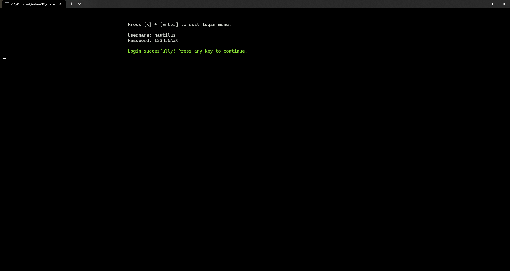
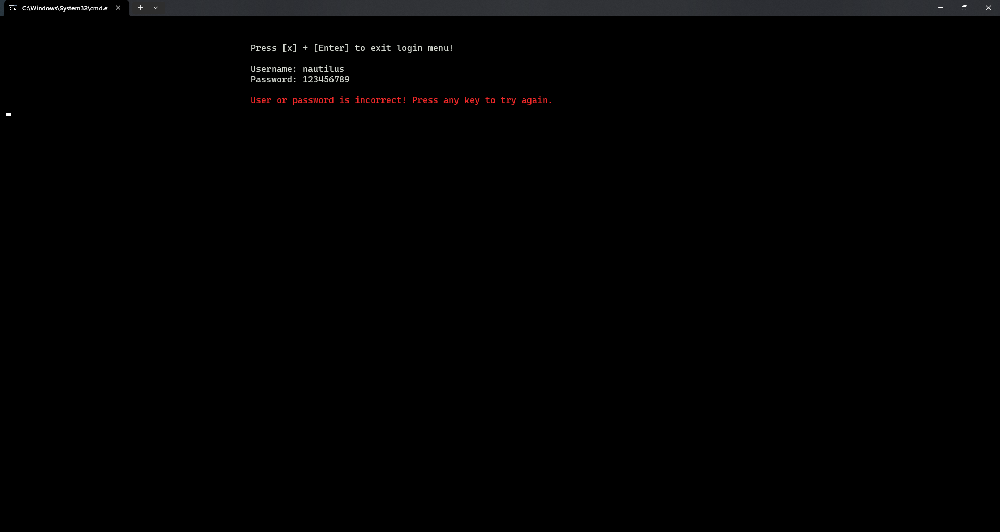

# 2048 trong C++

*Đây là một dự án đơn giản mô phỏng trò chơi 2048 sử dụng C++, đồng thời là đồ án trong môn học **Kỹ thuật lập trình**. Trò chơi được chơi trên một lưới hình vuông, trong đó người chơi kết hợp các ô có cùng số để tạo các ô mới có số cao hơn và chiến thắng khi đạt 2048.*

# I. Giới thiệu

## 1. Tác giả

- **Họ và tên**: Tô Thành Long.
- **MSSV**: 23120143.
- **Lớp**: 23CTT2.
- **Khoa**: Công nghệ thông tin.

## 2. Cài đặt

Trò chơi này được xây dựng hoàn toàn trên **VS Code**. Để biên dịch và chạy trò chơi, hãy làm theo các bước sau:

1. Sao chép github repository (hoặc tải mã nguồn xuống).

    ```shell
    git clone https://github.com/longtoZ/2048.git
    ```

2. Mở Terminal hoặc Command Prompt và điều hướng đến thư mục dự án.
3. Biên dịch mã bằng trình biên dịch C++. Ví dụ: người chơi có thể sử dụng lệnh sau với `g++`:
    - Biên dịch không gắn thông tin gỡ lỗi:

        ```shell
        g++ -I ./core/headers/ ./core/*.cpp main.cpp -o 2048
        ```
    - Biên dịch có gắn thông tin gỡ lỗi (xem thêm tại [Phụ lục 1](#III-Phụ-lục)):

        ```shell
        g++ -I ./core/headers/ ./core/*.cpp main.cpp -o 2048 -g
        ```

4. Chạy trò chơi:

    ```shell
    2048.exe 
    # hoặc ./2048.exe
    ```

## 3. Cách chơi

- Sử dụng các phím mũi tên (**lên, xuống, trái, phải**) để di chuyển các ô theo hướng tương ứng. Các phím chức năng khác sẽ được hướng dẫn trong mỗi phần.
- Các ô có cùng số sẽ hợp nhất thành một ô có tổng giá trị của chúng.
- Sau mỗi lần di chuyển, một ô mới có giá trị 2 hoặc 4 sẽ xuất hiện trên bảng.
- Trò chơi kết thúc khi không còn nước đi nào hợp lệ hoặc khi xuất hiện ô có giá trị **2048**.

## 4. Tính năng

- Tuỳ chọn kích thước bảng (4x4, 5x5, ..., 10x10).
- Undo, redo vô hạn trong khi chơi.
- Quản lí thành tích cá nhân bằng tài khoản riêng của người chơi.
- Lưu trò chơi và tiếp tục chơi bất cứ lúc nào.
- Xem thành tích của mỗi lần chơi.
- Xem bảng xếp hạng thành tích từ tất cả người chơi.

## 5. Xây dựng bởi

- **Ngôn ngữ lập trình**: C++.
- **Công cụ**: Visual Studio Code.
- **Hệ điều hành**: Windows.

# II. Cấu trúc dự án

## 1. Cấu trúc thư mục

- `./core`: chứa các file mã nguồn chính của trò chơi.

- `./core/headers`: chứa định nghĩa của các hàm được sử dụng trong **core**.

- `./database`: chứa các file dữ liệu của trò chơi.

- `./img`: chứa hình ảnh minh họa cho **README.md**.

## 2. Cấu trúc mã nguồn

- `README.md`: file hướng dẫn sử dụng dự án.
- `main.cpp`: file thực thi chính của trò chơi.
- `2048.exe`: trò chơi đã được biên dịch.
- `./core`: chứa các file mã nguồn chính của trò chơi. Bao gồm:
    - `./core/init.cpp` và `./core/headers/init.h`: chứa các hàm điều hướng các màn hình chính của trò chơi. Đây cũng là nơi khởi tạo **User** để lưu thông tin đăng nhập hiện tại.
    - `./core/user.cpp` và `./core/headers/user.h`: chứa các hàm xử lý thông tin tài khoản người chơi.
    - `./core/processGame.cpp` và `./core/headers/processGame.h`: chứa các hàm xử lí logic trò chơi, bao gồm tạo bảng, di chuyển ô, hợp nhất ô, kiểm tra kết thúc trò chơi, undo, redo.
    - `./core/handleRandom.cpp` và `./core/headers/handleRandom.h`: chứa các hàm xử lí tạo ô và giá trị ngẫu nhiên.
    - `./core/menu.cpp` và `./core/headers/menu.h`: chứa các hàm xử lí giao diện và hoạt động của màn chơi (chơi mới hoặc chơi tiếp).
    - `./core/display.cpp` và `./core/headers/display.h`: chứa các hàm xây dựng giao diện của tất cả màn hình trong trò chơi.
    - `./core/continueGame.cpp` và `./core/headers/continueGame.h`: chứa các hàm lưu và đọc màn chơi trước đó của người chơi.
    - `./core/leaderboard.cpp` và `./core/headers/leaderboard.h`: chứa các hàm xử lí lưu trữ thành tích và cập nhật bảng xếp hạng người chơi.
    - `./core/utils.cpp` và `./core/headers/utils.h`: chứa các hàm hỗ trợ bổ sung cho các chức năng chính của trò chơi.
    - `./core/effect.cpp` và `./core/headers/effect.h`: chứa các hàm xử lí hiệu ứng chuyển cảnh trong trò chơi.
    - `./core/list.cpp` và `./core/headers/list.h`: chứa các hàm xử lí danh sách liên kết người chơi.
    - `./core/stack.cpp` và `./core/headers/stack.h`: chứa các hàm xử lí stack để thực hiện undo, redo.
    - `./core/cleanup.cpp` và `./core/headers/cleanup.h`: chứa các hàm xử lí giải phóng bộ nhớ khi kết thúc trò chơi.

    - `./core/headers/keys.h`: chứa các định nghĩa mã màu, phím chức năng và hằng số được sử dụng trong dự án.
    - `./core/headers/structs.h`: chứa các định nghĩa cấu trúc dữ liệu được sử dụng trong dự án.

- `./database`: chứa các file dữ liệu của trò chơi. Bao gồm:
    - `./database/user.bin`: lưu thông tin tài khoản người chơi bao gồm **username** và **password**.
    - `./database/${username}_achievement.bin`: lưu thông tin thành tích của người chơi bao gồm **date**, **size**, **score**, **steps** và **interval**.
    - `./database/${username}_best.bin`: lưu thông tin thành tích tốt nhất trong số các thành tích mà người chơi đã lưu bao gồm **date**, **size**, **score**, **steps** và **interval**.
    - `./database/${username}_prevboard.bin`: lưu thông tin bảng trước đó của người chơi bao gồm **size**, **score**, **step**, **duration**.

## 3. Các màn hình chính

### 3.1. Màn hình cảnh báo

- Màn hình này sẽ hiển thị thông báo kích thước cửa sổ không đủ lớn để chơi trò chơi. Người chơi sẽ được yêu cầu thay đổi kích thước cửa sổ hoặc thoát trò chơi.

    

### 3.2. Trang chủ

- Người chơi sẽ được chuyển đến màn hình này sau khi mở trò chơi. Trước khi vào trang chủ, người chơi sẽ thấy hiệu ứng chuyển cảnh mở đầu của trò chơi. 

    

    > Hiệu ứng chuyển cảnh sẽ xuất hiện tại một số màn hình khác nhau trong trò chơi.

- Màn hình trang chủ bao gồm các chức năng chính:
    - Login.
    - Register.
    - View global leaderboard.
    - Exit.

- Người chơi di chuyển giữa các chức năng bằng các phím **mũi tên lên, xuống** và chọn chức năng bằng phím **Enter**.

    

### 3.3. Đăng nhập

- Người chơi sẽ được chuyển đến màn hình này khi chọn chức năng **Login** ở màn hình trang chủ.
- Người chơi sẽ được yêu cầu nhập **username** và **password** để đăng nhập, hoặc ấn phím `x` + `Enter` để quay lại trang chủ.
- Nếu thông tin đăng nhập không chính xác, người chơi sẽ được thông báo và được yêu cầu nhập lại. Nếu thông tin đăng nhập chính xác, người chơi sẽ được chuyển đến màn hình chơi.

    
    

### 3.4. Đăng ký

- Người chơi sẽ được chuyển đến màn hình này khi chọn chức năng **Register** ở màn hình trang chủ.
- Người chơi sẽ được yêu cầu nhập **username** và **password** để đăng ký, hoặc ấn phím `x` + `Enter` để quay lại trang chủ.
- Với **username**, người chơi không được phép đăng ký trùng với các **username** đã tồn tại trong cơ sở dữ liệu. Đồng thời, **username** phải có độ dài từ 1 đến 16 kí tự và không chứa kí tự đặc biệt.
- Với **password**, phải có độ dài từ 8 đến 32 kí tự, chứa ít nhất 1 chữ cái viết hoa, 1 chữ cái viết thường, 1 số và 1 kí tự đặc biệt. Người chơi sẽ được yêu cầu xác nhận mật khẩu 1 lần nữa.

    
    
    
    

### 3.5. Bảng xếp hạng

- Người chơi sẽ được chuyển đến màn hình này khi chọn chức năng `View global leaderboard` ở màn hình trang chủ.
- Màn hình này sẽ hiển thị 20 người chơi có điểm cao nhất trong cơ sở dữ liệu.

    

- Khi chọn `View global leaderboard` ở màn hình chơi, tên của người chơi sẽ được tô đậm nếu người chơi nằm trong top 20

    

### 3.6. Màn hình chơi

- Người chơi sẽ được chuyển đến màn hình này khi đăng nhập thành công. Màn hình chơi bao gồm các chức năng chính:
    - Start new game.
    - Continue  previous game.
    - View your achievement.
    - View global leaderboard.
    - Delete account.
    - Logout.

    
    

### 3.7. Màn chơi mới

- Trước khi chơi, người chơi sẽ được yêu cầu chọn kích thước bảng (4x4, 5x5,...) và chọn bật/tắt chức năng undo/redo.
- Sau khi thiết lập xong, người chơi sẽ được chuyển đến màn hình chơi. 

    

- Màn hình chơi sẽ được chia làm 2 phần: bảng thông tin và bảng chơi.

    

- Bản thông tin hiển thị các nội dung chính của trò chơi **score**, **best (thành tích cá nhân cao nhất)**, **steps**, **undo steps** và **redo steps**. Các chức năng chính trong màn chơi bao gồm:
    - Di chuyển các ô trên bảng bằng các phím mũi tên lên, xuống, trái, phải.
    - Undo, redo bằng các phím `u` và `r` (chỉ khả dụng khi người chơi thiết lập trước khi bắt đầu).
    - Save game bằng phím `s`.
    - Exit game bằng phím `x`.

- Bảng chơi hiển thị các ô và giá trị của chúng. Mỗi ô sẽ có một màu khác nhau tùy thuộc vào giá trị của ô đó.

    

- Với chức năng **undo/redo**, người chơi có thể quay lại hoặc tiếp tục một bước di chuyển trước đó. Số lần **undo/redo** khả dụng sẽ được hiển thị trên bảng thông tin. Khi số lần **undo/redo** hết, người chơi sẽ được thông báo và không thể thực hiện chức năng này.

    > Lưu ý: Khi người chơi **save game** và tiếp tục chơi, các bước **undo/redo** trước đó sẽ không được lưu và trò chơi sẽ tính từ trạng thái mới nhất.

- Với chức năng **save game**, người chơi có thể lưu trò chơi hiện tại và tiếp tục chơi bất cứ lúc nào. Khi lưu trò chơi, các thông tin về bảng chơi, điểm số, số bước đi, thời gian chơi sẽ được lưu lại.

    > *Khi tiếp tục chơi, ngoài các thông tin đã được lưu, thời gian chơi sẽ được cộng tiếp vào lần chơi trước đó.*

- Khi kết thúc trò chơi (**end game**), người chơi sẽ được tuỳ chọn lưu thành tích hoặc không. Nếu chọn **Yes**, thành tích của người chơi sẽ được lưu vào trong tài khoản và người chơi có thể xem thành tích của mình tại `View your achievement`.

- Khi không còn nước đi hợp lệ, tức là người chơi đã thua, người chơi sẽ được hỏi muốn tiếp tục chơi hay không? Nếu chọn **Yes**, người chơi sẽ dùng undo/redo để chơi đến khi nào người chơi tự kết thúc. Nếu chọn **No**, người chơi sẽ được tuỳ chọn lưu thành tích như trên.

    > Nếu trước khi chơi, người chơi không bật chức năng **undo/redo**, người chơi sẽ không thể tiếp tục chơi sau khi thua.

    
    

- Khi điểm hiện tại của người chơi cao hơn điểm cao nhất của người chơi (**Best**), điểm cao nhất sẽ được cập nhật và hiển thị trên bảng thông tin.

- Khi người chơi đã đạt được ô có giá trị **2048**, hệ thống sẽ hiển thị vị trí của người chơi trong top 20 người chơi có điểm cao nhất (nếu có). Đồng thời, người chơi sẽ được hỏi muốn tiếp tục chơi hay không? Nếu chọn **Yes**, người chơi sẽ tiếp tục chơi đến khi người chơi tự kết thúc. Nếu chọn **No**, người chơi sẽ được tuỳ chọn lưu thành tích như trên.

    
    

    > Ở đây, vì mục đích trình bày, tôi đã giả sử người chơi thắng khi đạt giá trị **32**. Trong thực tế, người chơi sẽ thắng khi đạt giá trị **2048** (có thể sửa đổi tại `./core/processGame.cpp ~ gameWon()`).

### 3.8. Màn chơi tiếp

- Người chơi chỉ có thể chơi tiếp khi đã lưu trò chơi trước đó. Giống như màn chơi mới, người chơi sẽ được tuỳ chọn bật/tắt chức năng undo/redo trước khi chơi và tiếp tục chơi từ trạng thái trước đó.
- Các chức năng chính trong màn chơi tiếp giống như màn chơi mới.

### 3.9. Thành tích cá nhân

- Người chơi sẽ được chuyển đến màn hình này khi chọn chức năng **View your achievement** ở màn hình chơi.
- Màn hình này sẽ hiển thị tất cả thành tích của người chơi bao gồm **rank**, **date**, **size**, **score**, **steps** và **interval**. Hạng của người chơi sẽ được sắp xếp từ cao đến thấp dựa trên điểm số mỗi lần chơi.

    

- Người chơi có thể xoá tất cả thành tích đã lưu bằng cách chọn chức năng **Reset achievement**.

### 3.10. Xoá tài khoản

- Người chơi sẽ được chuyển đến màn hình này khi chọn chức năng **Delete account** ở màn hình chơi.

    

- Người chơi sẽ được yêu cầu xác nhận lại một lần nữa trước khi xoá tài khoản. Nếu đồng ý, tài khoản của người chơi sẽ bị xoá khỏi cơ sở dữ liệu (bao gồm việc xoá các file `./database/${username}_achievement.bin`, `./database/${username}_best.bin`, `./database/${username}_prevboard.bin`). Đồng thời, **username** và **password** của người chơi sẽ bị xoá khỏi file `./database/user.bin`.

- Các thành tích của người chơi cũng bị xoá, điều này đồng nghĩa với việc vị trị của người chơi trong top 20 người chơi sẽ không còn nữa.

### 3.11. Đăng xuất tài khoản

- Người chơi sẽ được chuyển về trang chủ khi chọn chức năng **Logout** ở màn hình chơi.

    

### 3.12. Thoát trò chơi

- Chương trình sẽ thoát khi người chơi chọn chức năng **Exit** ở trang chủ.

    

## 4. Quản lí dữ liệu trò chơi

### 4.1. Tài khoản người chơi

- Mỗi người chơi sẽ cần một tài khoản để chơi. Tài khoản này là nơi lưu trữ thành tích cá nhân (bao gồm **date, size, score, steps và interval**) và màn chơi trước đó (bao gồm **size, score, step, duration**) để có thể chơi tiếp.

- Người chơi đăng nhập vào tài khoản bằng **username** và **password** mà mình đã đăng kí tại trước đó. Nếu thông tin đăng nhập không chính xác, người chơi sẽ không thể chơi.

### 4.2. Thành tích cá nhân

- Mỗi người chơi sẽ có một bảng thành tích cá nhân. Bảng này sẽ lưu lại tất cả thành tích của người chơi bao gồm **date, size, score, steps và interval**. Thành tích này sẽ được sắp xếp từ cao đến thấp dựa trên điểm số mỗi lần chơi.

- Thành tích cá nhân sẽ chỉ được lưu khi người chơi chọn **Yes** khi kết thúc trò chơi hoặc khi đạt giá trị **2048**. Nếu chọn **No**, thành tích sẽ không được lưu.

- **Thành tích cá nhân cao nhất** là dữ liệu để so sánh thứ hạng với những người chơi khác trong top 20 (nếu có).

- Người chơi có thể xoá tất cả thành tích đã lưu bằng cách chọn chức năng **Reset achievement**.

### 4.3. Top 20 người chơi có điểm cao nhất

- Bảng xếp hạng này lấy dữ liệu từ **thành tích cá nhân cao nhất** của tất cả người chơi và hiển thị 20 người chơi có thành tích cao nhất. Do đó, mỗi người chơi hoàn toàn có thể thay đổi vị trí của mình trong bảng xếp hạng bằng cách tiếp tục chơi và đạt điểm số cao hơn.

    > Bảng xếp hạng sẽ không có người chơi cùng tên.

# III. Phụ lục

## 1. Cài đặt Debugging dự án trong VS Code

- Để cài đặt **Debugger** cho dự án, người chơi cần tạo một file `launch.json` và `tasks.json` trong thư mục `.vscode` của dự án. File này sẽ chứa các cài đặt để biên dịch và chạy dự án.
- Dưới đây là cấu hình mẫu cho hệ điều hành **Windows**:

    ```json
    // launch.json
    {
        "version": "0.2.0",
        "configurations": [
            {
                "name": "(gdb) Launch",
                "type": "cppdbg",
                "request": "launch",
                "program": "${workspaceFolder}\\2048.exe",
                "args": [],
                "stopAtEntry": true,
                "cwd": "${fileDirname}",
                "environment": [],
                "externalConsole": true,
                "MIMode": "gdb",
                "miDebuggerPath": "C:/MinGW/bin/gdb.exe",
                "setupCommands": [
                    {
                        "description": "Enable pretty-printing for gdb",
                        "text": "-enable-pretty-printing",
                        "ignoreFailures": true
                    }
                ],
            }

        ]
    }
    ```

    ```json
    // tasks.json
    {
        "tasks": [
            {
                "type": "cppbuild",
                "label": "C/C++: gcc.exe build active file",
                "command": "C:\\MinGW\\bin\\gcc.exe",
                "args": [
                    "-fdiagnostics-color=always",
                    "-g",
                    "${workspaceFolder}\\core\\*.cpp ${workspaceFolder}\\core\\*.h ${workspaceFolder}\\main.cpp",
                    "-o",
                    "${workspaceFolder}\\2048.exe"
                ],
                "options": {
                    "cwd": "${fileDirname}"
                },
                "problemMatcher": [
                    "$gcc"
                ],
                "group": {
                    "kind": "build",
                    "isDefault": true
                },
                "detail": "Task generated by Debugger."
            }
        ],
        "version": "2.0.0"
    }
    ```

- Sau đó, compile chương trình `2048.exe` bằng cách mở **Terminal** và chạy lệnh sau:

    ```shell
    g++ -I ./core/headers/ ./core/*.cpp main.cpp -o 2048 -g
    ```

- Cuối cùng, mở `main.cpp` và chọn **Run and Debug (F5)** để chạy chương trình.

    > Lưu ý: Có thể đặt breakpoints bất cứ khi nào chương trình gặp Exceptions hoặc tại dòng code cần kiểm tra.
    >
    > 

## 2. Các thư viện được sử dụng

- `iostream`: thư viện để xử lý nhập xuất dữ liệu.
- `fstream`: thư viện để xử lý nhập xuất file.
- `string`: thư viện để xửa lý chuỗi.
- `conio.h`: thư viện để xử lý nhập xuất dữ liệu không đồng bộ.
- `ctime`: thư viện để xử lý thời gian.
- `iomanip`: thư viện để xử lý định dạng dữ liệu.
- `sstream`: thư viện để xử lý chuỗi.
- `windows.h`: thư viện để tương tác với hệ điều hành Windows.
- `chrono`: thư viện để xử lý thời gian.
- `regex`: thư viện để xử lý biểu thức chính quy.

## 3. Các nguồn tham khảo

> Nguồn tham khảo được ghi kèm theo mỗi hàm trong mã nguồn (nếu có).

- [https://stackoverflow.com/questions/31255486/how-do-i-convert-a-stdchronotime-point-to-long-and-back](https://stackoverflow.com/questions/31255486/how-do-i-convert-a-stdchronotime-point-to-long-and-back)
- [https://stackoverflow.com/questions/31255486/how-do-i-convert-a-stdchronotime-point-to-long-and-back](https://stackoverflow.com/questions/31255486/how-do-i-convert-a-stdchronotime-point-to-long-and-back)
- [https://stackoverflow.com/questions/31657511/how-to-get-the-difference-between-two-points-in-time-in-milliseconds](https://stackoverflow.com/questions/31657511/how-to-get-the-difference-between-two-points-in-time-in-milliseconds)
- [https://www.geeksforgeeks.org/c-program-delete-file/](https://www.geeksforgeeks.org/c-program-delete-file/)
- [https://www.geeksforgeeks.org/rename-function-in-ccpp/](https://www.geeksforgeeks.org/rename-function-in-ccpp/)
- [https://www.geeksforgeeks.org/how-to-use-gotoxy-in-codeblocks/](https://www.geeksforgeeks.org/how-to-use-gotoxy-in-codeblocks/)
- [https://stackoverflow.com/questions/34522617/ignore-keyboard-input-during-sleep-in-c](https://stackoverflow.com/questions/34522617/ignore-keyboard-input-during-sleep-in-c)
- [https://stackoverflow.com/questions/23369503/get-size-of-terminal-window-rows-columns](https://stackoverflow.com/questions/23369503/get-size-of-terminal-window-rows-columns)
- [https://stackoverflow.com/questions/70696610/is-there-an-easier-way-to-get-the-current-time-in-hhmmss-format](https://stackoverflow.com/questions/70696610/is-there-an-easier-way-to-get-the-current-time-in-hhmmss-format)
- [https://www.w3schools.com/python/python_regex.asp](https://www.w3schools.com/python/python_regex.asp)
- [https://www.geeksforgeeks.org/regex_replace-in-cpp-replace-the-match-of-a-string-using-regex_replace/](https://www.geeksforgeeks.org/regex_replace-in-cpp-replace-the-match-of-a-string-using-regex_replace/)
- [https://www.geeksforgeeks.org/swap-nodes-in-a-linked-list-without-swapping-data/](https://www.geeksforgeeks.org/swap-nodes-in-a-linked-list-without-swapping-data/)