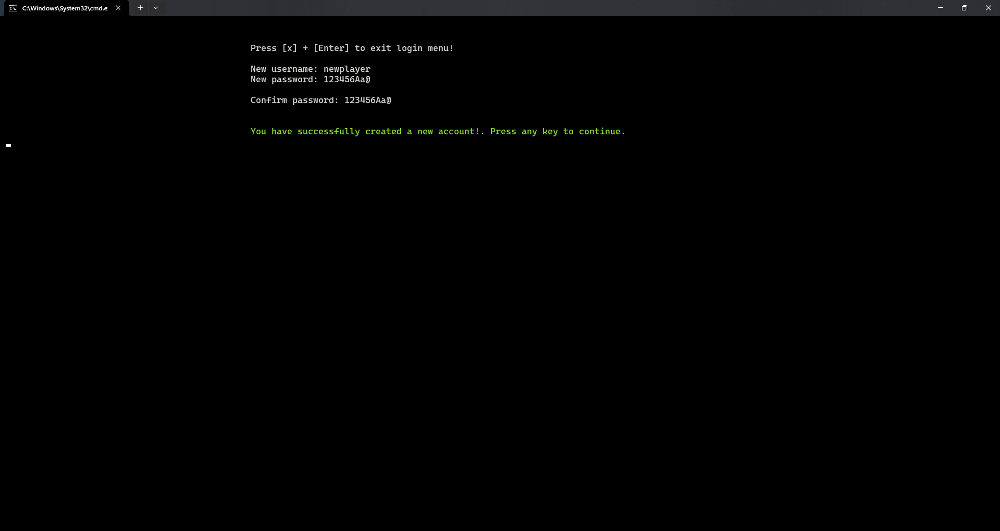
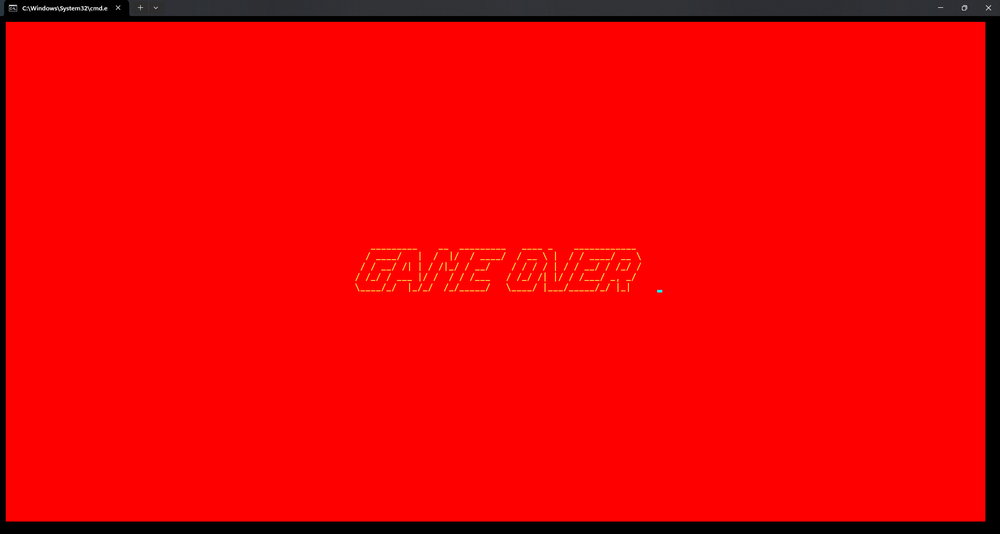

<h1 align="center" style="font-size: 50px">2048 trong C++</h1>

*Đây là một dự án đơn giản mô phỏng trò chơi phổ biến 2048 sử dụng C++, đồng thời là đồ án trong môn học **Kỹ thuật lập trình**. Trò chơi được chơi trên một lưới hình vuông, trong đó người chơi kết hợp các ô có cùng số để tạo các ô mới có số cao hơn và chiến thắng khi đạt 2048.*

# I. Giới thiệu

## 1. Bắt đầu

Trò chơi này được xây dựng hoàn toàn trên **VS Code**. Để biên dịch và chạy trò chơi, hãy làm theo các bước sau:

1. Sao chép github repository (hoặc tải mã nguồn xuống).

    ```shell
    git clone https://github.com/longtoZ/2048.git
    ```

2. Mở Terminal hoặc Command Prompt và điều hướng đến thư mục dự án.
3. Biên dịch mã bằng trình biên dịch C++. Ví dụ: bạn có thể sử dụng lệnh sau với `g++`:
    - Biên dịch không gắn thông tin gỡ lỗi:

        ```shell
        g++ -I ./core/headers/ ./core/*.cpp main.cpp -o 2048
        ```
    - Biên dịch có gắn thông tin gỡ lỗi (xem thêm tại [Phụ lục 1](#phu-luc)):

        ```shell
        g++ -I ./core/headers/ ./core/*.cpp main.cpp -o 2048 -g
        ```

4. Chạy trò chơi:

    ```shell
    2048.exe 
    # hoặc ./2048.exe
    ```

## 2. Cách chơi

- Sử dụng các phím mũi tên (**lên, xuống, trái, phải**) để di chuyển các ô theo hướng tương ứng. Các phím chức năng khác sẽ được hướng dẫn trong mỗi phần.
- Các ô có cùng số sẽ hợp nhất thành một ô có tổng giá trị của chúng.
- Sau mỗi lần di chuyển, một ô mới có giá trị 2 hoặc 4 sẽ xuất hiện trên bảng.
- Trò chơi kết thúc khi không còn nước đi nào hợp lệ hoặc khi xuất hiện ô có giá trị **2048**.

## 3. Tính năng

- Tuỳ chọn kích thước bảng (4x4, 5x5, ..., 10x10).
- Undo, redo vô hạn trong khi chơi.
- Lưu trò chơi và tiếp tục chơi bất cứ lúc nào.
- Xem thành tích của bạn của mỗi lần chơi.
- Tạo tài khoản và xem bảng xếp hạng thành tích từ tất cả người chơi.

## 4. Xây dựng bởi

- **Ngôn ngữ lập trình**: C++.
- **Công cụ**: Visual Studio Code.
- **Hệ điều hành**: Windows.

# II. Cấu trúc dự án

## 1. Cấu trúc thư mục

- `./core`: chứa các file mã nguồn chính của trò chơi.
- `./core/headers`: chứa định nghĩa của các hàm được sử dụng trong **core**.
- `./database`: chứa các file dữ liệu của trò chơi.

## 2. Cấu trúc mã nguồn

- `main.cpp`: file thực thi chính của trò chơi.
- `2048.exe`: trò chơi đã được biên dịch.
- `./core`: chứa các file mã nguồn chính của trò chơi. Bao gồm:
    - `./core/init.cpp` và `./core/headers/init.h`: chứa các hàm điều hướng các màn hình chính của trò chơi. Đây cũng là nơi khởi tạo **User** để lưu thông tin đăng nhập hiện tại.
    - `./core/user.cpp` và `./core/headers/user.h`: chứa các hàm xử lý thông tin tài khoản người chơi.
    - `./core/processGame.cpp` và `./core/headers/processGame.h`: chứa các hàm xử lí logic trò chơi, bao gồm tạo bảng, di chuyển ô, hợp nhất ô, kiểm tra kết thúc trò chơi, undo, redo.
    - `./core/handleRandom.cpp` và `./core/headers/handleRandom.h`: chứa các hàm xử lí tạo ô và giá trị ngẫu nhiên.
    - `./core/menu.cpp` và `./core/headers/menu.h`: chứa các hàm xử lí giao diện và hoạt động của màn chơi (chơi mới hoặc chơi tiếp).
    - `./core/display.cpp` và `./core/headers/display.h`: chứa các hàm xây dựng giao diện của tất cả màn hình trong trò chơi.
    - `./core/continueGame.cpp` và `./core/headers/continueGame.h`: chứa các hàm lưu và đọc màn chơi trước đó của người chơi.
    - `./core/leaderboard.cpp` và `./core/headers/leaderboard.h`: chứa các hàm xử lí lưu trữ thành tích và cập nhật bảng xếp hạng người chơi.
    - `./core/utils.cpp` và `./core/headers/utils.h`: chứa các hàm hỗ trợ bổ sung cho các chức năng chính của trò chơi.
    - `./core/effect.cpp` và `./core/headers/effect.h`: chứa các hàm xử lí hiệu ứng chuyển cảnh trong trò chơi.
    - `./core/list.cpp` và `./core/headers/list.h`: chứa các hàm xử lí danh sách liên kết người chơi.
    - `./core/stack.cpp` và `./core/headers/stack.h`: chứa các hàm xử lí stack để thực hiện undo, redo.
    - `./core/cleanup.cpp` và `./core/headers/cleanup.h`: chứa các hàm xử lí giải phóng bộ nhớ khi kết thúc trò chơi.

    - `./core/headers/keys.h`: chứa các định nghĩa mã màu, phím chức năng và hằng số được sử dụng trong dự án.
    - `./core/headers/structs.h`: chứa các định nghĩa cấu trúc dữ liệu được sử dụng trong dự án.

- `./database`: chứa các file dữ liệu của trò chơi. Bao gồm:
    - `./database/user.bin`: lưu thông tin tài khoản người chơi bao gồm **username** và **password**.
    - `./database/${username}_achievement.bin`: lưu thông tin thành tích của người chơi bao gồm **date**, **size**, **score**, **steps** và **interval**.
    - `./database/${username}_best.bin`: lưu thông tin thành tích tốt nhất trong số các thành tích mà người chơi đã lưu bao gồm **date**, **size**, **score**, **steps** và **interval**.
    - `./database/${username}_prevboard.bin`: lưu thông tin bảng trước đó của người chơi bao gồm **size**, **score**, **step**, **duration**.

## 3. Các màn hình chính

### a. Màn hình cảnh báo

- Màn hình này sẽ hiển thị thông báo kích thước cửa sổ không đủ lớn để chơi trò chơi. Người chơi sẽ được yêu cầu thay đổi kích thước cửa sổ hoặc thoát trò chơi.

    

### b. Trang chủ

- Người chơi sẽ được chuyển đến màn hình này sau khi mở trò chơi. Trước khi vào trang chủ, người chơi sẽ thấy hiệu ứng chuyển cảnh mở đầu của trò chơi. 

    

    > Hiệu ứng chuyển cảnh sẽ xuất hiện tại một số màn hình khác nhau trong trò chơi.

- Màn hình trang chủ bao gồm các chức năng chính:
    - Login.
    - Register.
    - View global leaderboard.
    - Exit.

- Người chơi di chuyển giữa các chức năng bằng các phím mũi tên lên, xuống và chọn chức năng bằng phím **Enter**.

    

### c. Đăng nhập

- Người chơi sẽ được chuyển đến màn hình này khi chọn chức năng **Login** ở màn hình trang chủ.
- Người chơi sẽ được yêu cầu nhập **username** và **password** để đăng nhập, hoặc ấn phím `x` + `Enter` để quay lại trang chủ.
- Nếu thông tin đăng nhập không chính xác, người chơi sẽ được thông báo và được yêu cầu nhập lại. Nếu thông tin đăng nhập chính xác, người chơi sẽ được chuyển đến màn hình chơi.

    
    

### d. Đăng ký

- Người chơi sẽ được chuyển đến màn hình này khi chọn chức năng **Register** ở màn hình trang chủ.
- Người chơi sẽ được yêu cầu nhập **username** và **password** để đăng ký, hoặc ấn phím `x` + `Enter` để quay lại trang chủ.
- Với **username**, người chơi không được phép đăng ký trùng với các **username** đã tồn tại trong cơ sở dữ liệu. Đồng thời, **username** phải có độ dài từ 1 đến 16 kí tự và không chứa kí tự đặc biệt.
- Với **password**, phải có độ dài từ 8 đến 32 kí tự, chứa ít nhất 1 chữ cái viết hoa, 1 chữ cái viết thường, 1 số và 1 kí tự đặc biệt. Người chơi sẽ được yêu cầu xác nhận mật khẩu 1 lần nữa.

    
    
    
    

### e. Bảng xếp hạng

- Người chơi sẽ được chuyển đến màn hình này khi chọn chức năng `View global leaderboard` ở màn hình trang chủ.
- Màn hình này sẽ hiển thị 20 người chơi có điểm cao nhất trong cơ sở dữ liệu.

    

- Khi chọn `View global leaderboard` ở màn hình chơi, tên của người chơi sẽ được tô đậm nếu người chơi nằm trong top 20

    

### f. Màn hình chơi

- Người chơi sẽ được chuyển đến màn hình này khi đăng nhập thành công. Màn hình chơi bao gồm các chức năng chính:
    - Start new game.
    - Continue  previous game.
    - View your achievement.
    - View global leaderboard.
    - Delete account.
    - Logout.

    
    

### g. Màn chơi mới

- Trước khi chơi, người chơi sẽ được yêu cầu chọn kích thước bảng (4x4, 5x5,...) và chọn bật/tắt chức năng undo/redo.
- Sau khi thiết lập xong, người chơi sẽ được chuyển đến màn hình chơi. 

    

- Màn hình chơi sẽ được chia làm 2 phần: bảng thông tin và bảng chơi.

    

- Bản thông tin hiển thị các nội dung chính của trò chơi **score**, **best**, **steps**, **undo steps** và **redo steps**. Các chức năng chính trong màn chơi bao gồm:
    - Di chuyển các ô trên bảng bằng các phím mũi tên lên, xuống, trái, phải.
    - Undo, redo bằng các phím `u` và `r` (chỉ khả dụng khi người chơi thiết lập trước khi bắt đầu).
    - Save game bằng phím `s`.
    - Exit game bằng phím `x`.

- Bảng chơi hiển thị các ô và giá trị của chúng. Mỗi ô sẽ có một màu khác nhau tùy thuộc vào giá trị của ô đó.

    

- Với chức năng **undo/redo**, người chơi có thể quay lại hoặc tiếp tục một bước di chuyển trước đó. Số lần **undo/redo** khả dụng sẽ được hiển thị trên bảng thông tin. Khi số lần **undo/redo** hết, người chơi sẽ được thông báo và không thể thực hiện chức năng này.

- Với chức năng **save game**, người chơi có thể lưu trò chơi hiện tại và tiếp tục chơi bất cứ lúc nào. Khi lưu trò chơi, các thông tin về bảng chơi, điểm số, số bước đi, thời gian chơi sẽ được lưu lại.

    > *Khi tiếp tục chơi, ngoài các thông tin đã được lưu, thời gian chơi sẽ được cộng tiếp vào lần chơi trước đó.*

- Khi kết thúc trò chơi (**end game**), bạn sẽ được tuỳ chọn lưu thành tích hoặc không. Nếu chọn **Yes**, thành tích của bạn sẽ được lưu vào trong tài khoản và bạn có thể xem thành tích của mình tại `View your achievement`.

- Khi không còn nước đi hợp lệ, tức là bạn đã thua, bạn sẽ được hỏi muốn tiếp tục chơi hay không? Nếu chọn **Yes**, bạn sẽ dùng undo/redo để chơi đến khi nào bạn tự kết thúc. Nếu chọn **No**, bạn sẽ được tuỳ chọn lưu thành tích như trên.

    > Nếu trước khi chơi, bạn không bật chức năng **undo/redo**, bạn sẽ không thể tiếp tục chơi khi thua.

    
    

- Khi bạn đã đạt được ô có giá trị **2048**, hệ thống sẽ hiển thị vị trí của bạn trong top 20 người chơi có điểm cao nhất. Đồng thời, bạn sẽ được hỏi muốn tiếp tục chơi hay không? Nếu chọn **Yes**, bạn sẽ tiếp tục chơi và đạt điểm số cao hơn. Nếu chọn **No**, bạn sẽ được tuỳ chọn lưu thành tích như trên.

    
    

    > Ở đây, vì mục đích trình bày, tôi đã giả sử người chơi thắng khi đạt giá trị **32**. Trong thực tế, người chơi sẽ thắng khi đạt giá trị **2048** (có thể sửa đổi tại `./core/processGame.cpp` `gameWon()`).

### h. Màn chơi tiếp

- Người chơi chỉ có thể chơi tiếp khi đã lưu trò chơi trước đó. Giống như màn chơi mới, bạn sẽ được tuỳ chọn bật/tắt chức năng undo/redo trước khi chơi và tiếp tục chơi từ trạng thái trước đó.
- Các chức năng chính trong màn chơi tiếp giống như màn chơi mới.

### i. Thành tích cá nhân

- Người chơi sẽ được chuyển đến màn hình này khi chọn chức năng **View your achievement** ở màn hình chơi.
- Màn hình này sẽ hiển thị tất cả thành tích của người chơi bao gồm **rank**, **date**, **size**, **score**, **steps** và **interval**. Hạng của người chơi sẽ được sắp xếp từ cao đến thấp dựa trên điểm số mỗi lần chơi.

    

- Bạn có thể xoá tất cả thành tích đã lưu bằng cách chọn chức năng **Reset achievement**.

### j. Xoá tài khoản

- Người chơi sẽ được chuyển đến màn hình này khi chọn chức năng **Delete account** ở màn hình chơi.

    

- Bạn sẽ được yêu cầu xác nhận lại một lần nữa trước khi xoá tài khoản. Nếu đồng ý, tài khoản của bạn sẽ bị xoá khỏi cơ sở dữ liệu và bạn sẽ được chuyển về màn hình trang chủ.

### k. Đăng xuất tài khoản

- Người chơi sẽ được chuyển về trang chủ khi chọn chức năng **Logout** ở màn hình chơi.

    

### j. Thoát trò chơi

- Chương trình sẽ thoát khi người chơi chọn chức năng **Exit** ở trang chủ.

    

# III. Phụ lục

## 1. Cài đặt Debugging dự án trong VS Code

- Để cài đặt **Debugging** cho dự án, bạn cần tạo một file `launch.json` và `tasks.json` trong thư mục `.vscode` của dự án. File này sẽ chứa các cài đặt để biên dịch và chạy dự án.
- Dưới đây là cấu hình mẫu cho hệ điều hành **Windows**:

    ```json
    // launch.json
    {
        "version": "0.2.0",
        "configurations": [
            {
                "name": "(gdb) Launch",
                "type": "cppdbg",
                "request": "launch",
                "program": "${workspaceFolder}\\2048.exe",
                "args": [],
                "stopAtEntry": true,
                "cwd": "${fileDirname}",
                "environment": [],
                "externalConsole": true,
                "MIMode": "gdb",
                "miDebuggerPath": "C:/MinGW/bin/gdb.exe",
                "setupCommands": [
                    {
                        "description": "Enable pretty-printing for gdb",
                        "text": "-enable-pretty-printing",
                        "ignoreFailures": true
                    }
                ],
            }

        ]
    }
    ```

    ```json
    // tasks.json
    {
        "tasks": [
            {
                "type": "cppbuild",
                "label": "C/C++: gcc.exe build active file",
                "command": "C:\\MinGW\\bin\\gcc.exe",
                "args": [
                    "-fdiagnostics-color=always",
                    "-g",
                    "${workspaceFolder}\\core\\*.cpp ${workspaceFolder}\\core\\*.h ${workspaceFolder}\\main.cpp",
                    "-o",
                    "${workspaceFolder}\\2048.exe"
                ],
                "options": {
                    "cwd": "${fileDirname}"
                },
                "problemMatcher": [
                    "$gcc"
                ],
                "group": {
                    "kind": "build",
                    "isDefault": true
                },
                "detail": "Task generated by Debugger."
            }
        ],
        "version": "2.0.0"
    }
    ```

- Sau đó, compile chương trình `2048.exe` bằng cách mở **Terminal** và chạy lệnh sau:

    ```shell
    g++ -I ./core/headers/ ./core/*.cpp main.cpp -o 2048 -g
    ```

- Cuối cùng, mở `main.cpp` và chọn **Run and Debug (F5)** để chạy chương trình.

    > Lưu ý: Có thể đặt breakpoints bất cứ khi nào chương trình gặp lỗi hoặc tại dòng code cần kiểm tra.
    >
    > 

## 2. Các thư viện được sử dụng

- `iostream`: thư viện để xử lý nhập xuất dữ liệu.
- `fstream`: thư viện để xử lý nhập xuất file.
- `string`: thư viện để xửa lý chuỗi.
- `conio.h`: thư viện để xử lý nhập xuất dữ liệu không đồng bộ.
- `ctime`: thư viện để xử lý thời gian.
- `iomanip`: thư viện để xử lý định dạng dữ liệu.
- `sstream`: thư viện để xử lý chuỗi.
- `windows.h`: thư viện để tương tác với hệ điều hành Windows.
- `chrono`: thư viện để xử lý thời gian.
- `regex`: thư viện để xử lý biểu thức chính quy.

## 3. Các nguồn tham khảo

> Nguồn tham khảo được ghi kèm theo từng hàm trong mã nguồn.

- [https://stackoverflow.com/questions/31255486/how-do-i-convert-a-stdchronotime-point-to-long-and-back](https://stackoverflow.com/questions/31255486/how-do-i-convert-a-stdchronotime-point-to-long-and-back)
- [https://stackoverflow.com/questions/31255486/how-do-i-convert-a-stdchronotime-point-to-long-and-back](https://stackoverflow.com/questions/31255486/how-do-i-convert-a-stdchronotime-point-to-long-and-back)
[https://stackoverflow.com/questions/31657511/how-to-get-the-difference-between-two-points-in-time-in-milliseconds](https://stackoverflow.com/questions/31657511/how-to-get-the-difference-between-two-points-in-time-in-milliseconds)
- [https://www.geeksforgeeks.org/c-program-delete-file/](https://www.geeksforgeeks.org/c-program-delete-file/)
- [https://www.geeksforgeeks.org/rename-function-in-ccpp/](https://www.geeksforgeeks.org/rename-function-in-ccpp/)
- [https://www.geeksforgeeks.org/how-to-use-gotoxy-in-codeblocks/](https://www.geeksforgeeks.org/how-to-use-gotoxy-in-codeblocks/)
- [https://stackoverflow.com/questions/34522617/ignore-keyboard-input-during-sleep-in-c](https://stackoverflow.com/questions/34522617/ignore-keyboard-input-during-sleep-in-c)
- [https://stackoverflow.com/questions/23369503/get-size-of-terminal-window-rows-columns](https://stackoverflow.com/questions/23369503/get-size-of-terminal-window-rows-columns)
- [https://stackoverflow.com/questions/70696610/is-there-an-easier-way-to-get-the-current-time-in-hhmmss-format](https://stackoverflow.com/questions/70696610/is-there-an-easier-way-to-get-the-current-time-in-hhmmss-format)
- [https://www.w3schools.com/python/python_regex.asp](https://www.w3schools.com/python/python_regex.asp)
- [https://www.geeksforgeeks.org/swap-nodes-in-a-linked-list-without-swapping-data/](https://www.geeksforgeeks.org/swap-nodes-in-a-linked-list-without-swapping-data/)